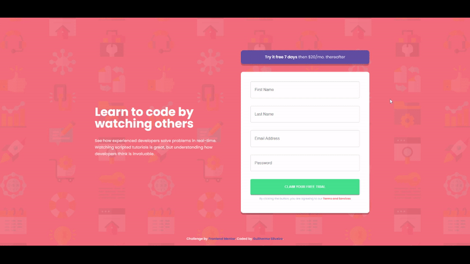

# Frontend Mentor - Intro component with sign up form solution

This is a solution to the [Intro component with sign up form challenge on Frontend Mentor](https://www.frontendmentor.io/challenges/intro-component-with-signup-form-5cf91bd49edda32581d28fd1). Frontend Mentor challenges help you improve your coding skills by building realistic projects.

## Table of contents

- [Overview](#overview)
  - [The challenge](#the-challenge)
  - [Screenshot](#screenshot)
  - [Links](#links)
- [My process](#my-process)
  - [Built with](#built-with)
  - [What I learned](#what-i-learned)
  - [Continued development](#continued-development)
  - [Useful resources](#useful-resources)
- [Author](#author)
- [Acknowledgments](#acknowledgments)

## Overview

### The challenge

Users should be able to:

- View the optimal layout for the site depending on their device's screen size
- See hover states for all interactive elements on the page
- Receive an error message when the `form` is submitted if:
  - Any `input` field is empty. The message for this error should say _"[Field Name] cannot be empty"_
  - The email address is not formatted correctly (i.e. a correct email address should have this structure: `name@host.tld`). The message for this error should say _"Looks like this is not an email"_

### Screenshot

### Links

- Solution URL: [Frontend Mentor](https://www.frontendmentor.io/solutions/responsive-intro-component-using-flexbox-and-js-clientside-validation-rVlLjp4UT)
- Live Site URL: [GitHub Pages](https://guisilveira.github.io/Intro-Component/)

## My process

### Built with

- Semantic HTML5 markup
- CSS custom properties
- Flexbox
- Mobile-first workflow
- JavaScript

### What I learned

This project was very helpful to learn more about form validation in the client-side. I chose to not use the constraint validation API and built my on validation. That taught me a lot about how the components works and how to interact with them using JavaScript to get the data that was provided after clicking to submit.

Also, I could learn a lot about how Regular Expressions works and how to implement them to validate data.

### Continued development

I want to use more the constraint validation API and learn more about the form validation methods whether in client-side or server-side.

### Useful resources

- [MDN - Form Validation](https://developer.mozilla.org/pt-BR/docs/Learn/Forms/Form_validation) - This helped me a lot to understand how the server-side validation can be done.
- [RegEx Library](https://uibakery.io/regex-library?ref=producthunt) - This provided to me useful RegEx resources and taught me how to implement it.

## Author

- LinkedIn - [Guilherme Silveira](https://www.linkedin.com/in/guilherme-silveira-coutinho/)
- Frontend Mentor - [@GuiSilveira](https://www.frontendmentor.io/profile/GuiSilveira)

## Acknowledgments

I want to thanks FlorinPop for the inspiration to do this project and also helped me to understand so many concepts.
